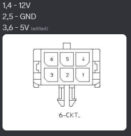
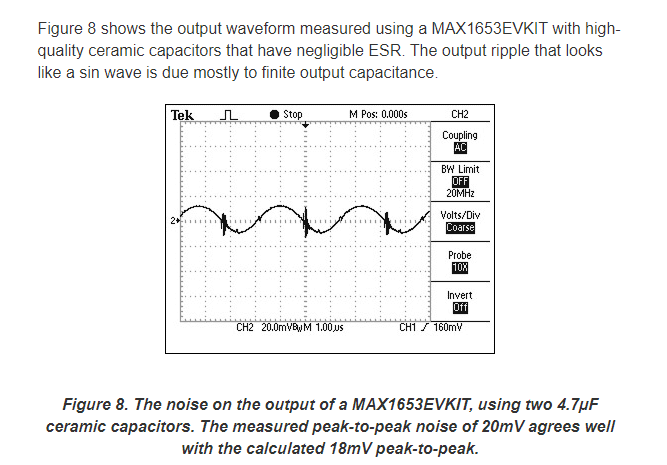
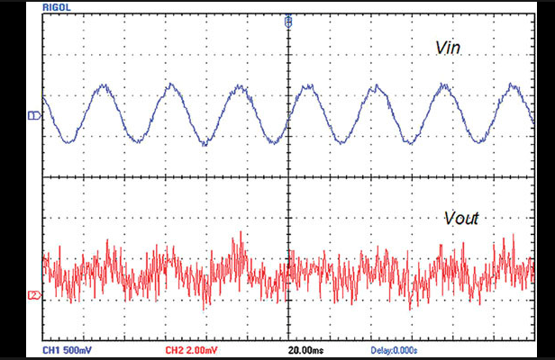

# Standard Components
### Power Supplies (LDO and Buck)
First things first, when designing a pcb you need to think how you are going to power it. How much voltage you need for the components (like MCU) and how much approximate current you are going to draw (you should always have a upper bound). And for that you will also need to know what you will plug into it, like a 12V in or a USB 5V in.

In ecocar we started to use a standard 6 pin molex connector, it is 2x03 (2 rows 3 columns) connector.

Now you need to think about what you will use to step it down to a usable voltage like 3v3, it is common in almost all MCUs and components.

In most cases its best to have a clean power output so a LDO (low drop out) Linear regulator. It uses a MOSFET as a variable resistor to change the large voltage to smaller.
Heres more info on what to pick and how:
[LDO Linear Regulators](LDO.md)

There is another more efficent way of stepping down voltage.

[Buck Regulators](Buck.md)

There are others but im not smart enough to use them.

Keep in mind a buck regulator is very noisy due to it being a switching regulator. Here is the output of a Buck vs LDO:

Buck: 

Source: [paper](https://www.analog.com/en/technical-articles/input-and-output-noise-in-buck-converters-explained.html)

LDO: 

Source [paper](https://onlinelibrary.wiley.com/doi/abs/10.1002/cta.641?scrollTo=references)
Although a bit exagerated the noise and Vpp is 2mV whereas the Buck is 20mV !

[How to pick a power supply](powersupply.md)

### Circuit protection:
Now you have to think about how to protect he circuit from surges and EFT (electrical fast transients) which are caused when you plug or unplug connections.
[eFuses and diodes](circuit-protection.md)

### MCUs
Stm32 are the best for almost all cases, use the mcu finder app in the cube ide to get the perfect one for the application.
[How to pick a mcu](mcu.md)

### Interfaces
The standard way to talk these days is CAN (controller area network). Its an industry standard communication protocol.

For CAN STM32 MCUs usually have an integrated controller, so all you need is a tranciever. A tranciever will just convert the 3v3 signals to 5v CAN network signals and provide isolation from the high voltage CAN lines and the snowflake mcu pins. also more importantly convert serial TX RX signals to CAN high and low. 

If you have a mcu with a low pin count it may combine the CAN controller and USB controller pins. in that case you can use a serial to usb ic like FTDI or a RS232 converter which works the same as usb but it will be just serial communication on a usb port.

[Interfaces](interfaces.md)